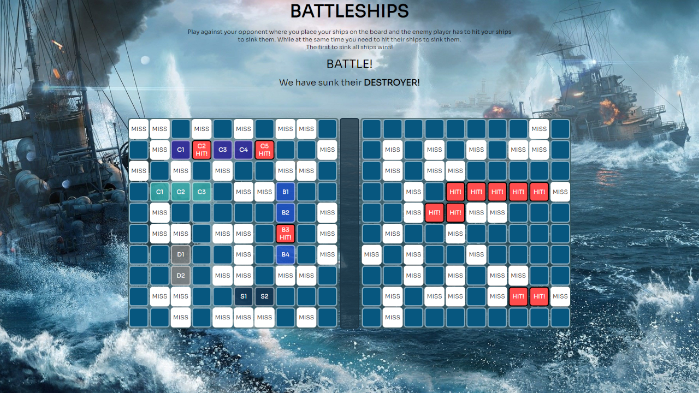
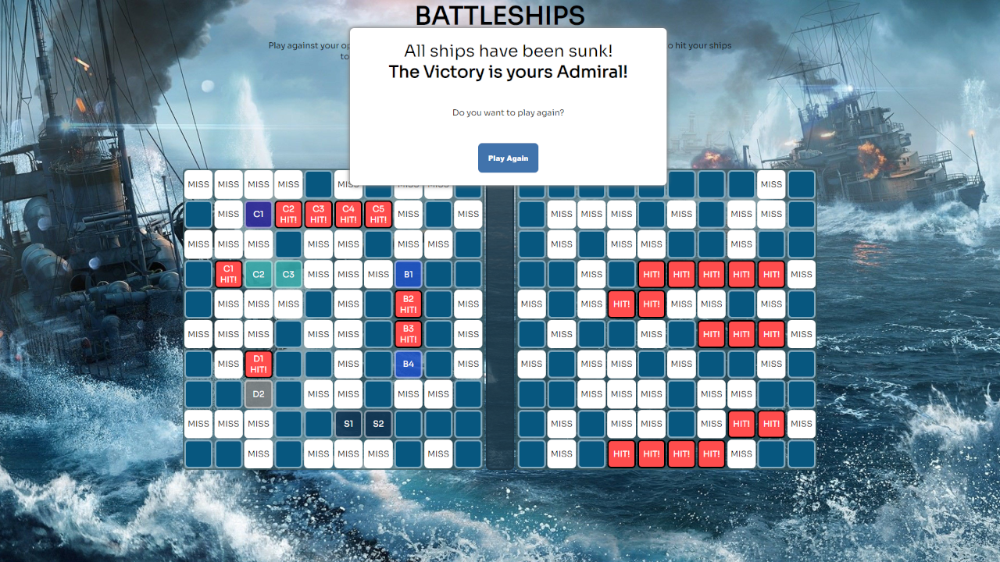

<<<<<<< HEAD
# battleship-TheOdinProject
The Battleship project from The Odin Project.

Site Link: https://nenopr.github.io/battleship-TheOdinProject/
=======
## 📌 Overview
A classic Battleship game. Place your ships and sink your enemies ships before they sink yours.

## 🛠️ Tech Stack
- Frontend: Javascript

## 🚀 Features
- Place your ships on the grid
- Attack enemy ships by selecting fields on the opponents grid

## 📸 Screenshots

	
	

## 🔗 Live Demo
[Demo Link](https://nenopr.github.io/battleship-TheOdinProject/)
>>>>>>> f434dd0 (Updated README and added images for it)
